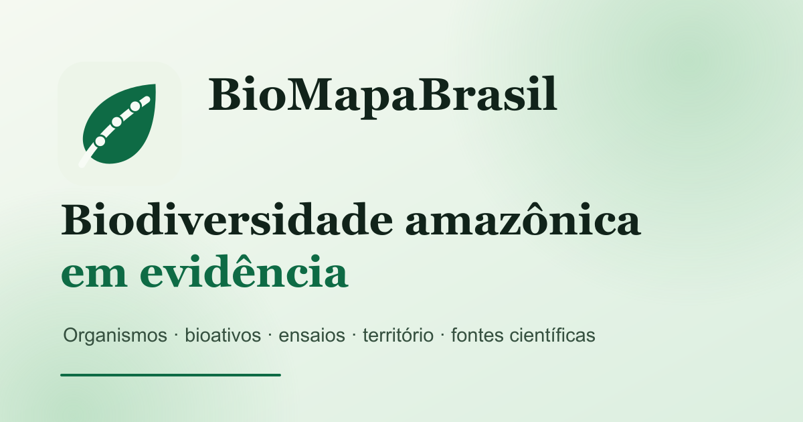

# BioMapaBrasil

<p align="center">
  <a href="https://aleff-ferreira.github.io/biomapabrasil/">
    
  </a>
</p>

<p align="center"><strong>Biodiversidade amazônica em evidência</strong><br>
Plataforma territorial para conectar organismos, bioativos, ensaios e fontes científicas.</p>

<p align="center">
  <a href="https://aleff-ferreira.github.io/biomapabrasil/"><strong>Explorar a demonstração</strong></a>
  ·
  <a href="docs/SCIENTIFIC_SCOPE.md">Escopo científico</a>
  ·
  <a href="docs/ARCHITECTURE.md">Arquitetura</a>
</p>

<p align="center">
  <a href="https://github.com/aleff-ferreira/biomapabrasil/actions/workflows/pages.yml"></a>
  <a href="LICENSE"></a>
</p>

> **Prova de conceito.** Esta versão demonstra a experiência de consulta e o modelo de organização da evidência propostos para o BioMapaBrasil. Os dez registros apresentados permitem testar a navegação, mas não constituem uma base exaustiva nem um recurso para decisão clínica ou regulatória.

## O problema científico

Resultados sobre produtos naturais amazônicos permanecem dispersos entre publicações e bases que descrevem separadamente o táxon, a procedência do material, o extrato ou biomolécula, as condições do ensaio e a atividade observada. A consulta isolada desses elementos dificulta comparar estudos e pode confundir ocorrência conhecida da espécie com a origem do material efetivamente investigado.

O BioMapaBrasil propõe preservar, para cada resultado, o percurso:

```text
procedência do material → organismo → preparação ou biomolécula → ensaio → resultado → fonte
```

## O que avaliar na demonstração

Em poucos minutos é possível:

1. explorar a distribuição documentada das espécies no território brasileiro;
2. filtrar os registros por grupo de organismo, atividade biológica ou unidade federativa;
3. percorrer a relação entre território, espécie, molécula e ação observada em ensaio;
4. alternar entre visualização relacional, mapa e tabela acessível;
5. verificar fontes, incertezas e informações ainda não recuperadas;
6. exportar o conjunto demonstrativo em CSV.

## Compromissos científicos

- **Procedência não é ocorrência.** A presença de uma espécie em determinado território não comprova a origem do material usado em um ensaio.
- **Associação não é eficácia.** A interface não converte uso tradicional ou atividade experimental em recomendação terapêutica.
- **Ausência permanece visível.** Campos não recuperados são apresentados explicitamente.
- **Curadoria identificável.** A versão completa preservará fonte, trecho de sustentação, decisão curatorial, data e histórico.
- **Reutilização responsável.** Direitos, sensibilidade territorial e autoridade comunitária integram os critérios de publicação.

## Decisões de engenharia

A prova de conceito foi implementada como uma aplicação estática autocontida:

- HTML, CSS e JavaScript sem dependências de execução;
- funcionamento responsivo em computador e dispositivo móvel;
- navegação por teclado, estados de foco e alternativa tabular ao mapa;
- temas claro e escuro e respeito à preferência por movimento reduzido;
- dados e imagens demonstrativos incorporados ao próprio arquivo;
- exportação local em CSV;
- ausência de cookies, rastreadores e coleta de dados pessoais;
- publicação reproduzível por GitHub Actions e GitHub Pages.

Essa escolha reduz barreiras de acesso para a avaliação. A arquitetura prevista para a pesquisa separa curadoria, validação, preservação e acesso público, conforme descrito em [docs/ARCHITECTURE.md](docs/ARCHITECTURE.md).

## Executar localmente

O protótipo não exige instalação:

```bash
git clone https://github.com/aleff-ferreira/biomapabrasil.git
cd biomapabrasil
```

Abra `index.html` em um navegador moderno. Para testar em um servidor local, utilize qualquer servidor HTTP estático.

## Estrutura do repositório

```text
.
├── index.html                    # prova de conceito executável
├── assets/                       # identidade visual e prévia social
├── docs/ARCHITECTURE.md          # decisões técnicas e evolução prevista
├── docs/SCIENTIFIC_SCOPE.md      # escopo, interpretação e limitações
├── CITATION.cff                  # citação do software
├── NOTICE.md                     # fontes e atribuições
└── .github/workflows/pages.yml   # publicação contínua
```

## Autoria e citação

Concepção científica, arquitetura da informação e desenvolvimento do protótipo: **Aleff Ferreira Francisco**.

Para citar esta prova de conceito, utilize os metadados de [CITATION.cff](CITATION.cff). Uma versão arquivada com identificador persistente será preparada para os produtos formais do projeto.

## Licença

O código original deste repositório é disponibilizado sob a [Licença MIT](LICENSE). Dados, imagens, estruturas químicas e referências de terceiros permanecem sujeitos às licenças e condições indicadas em [NOTICE.md](NOTICE.md) e na própria interface.
