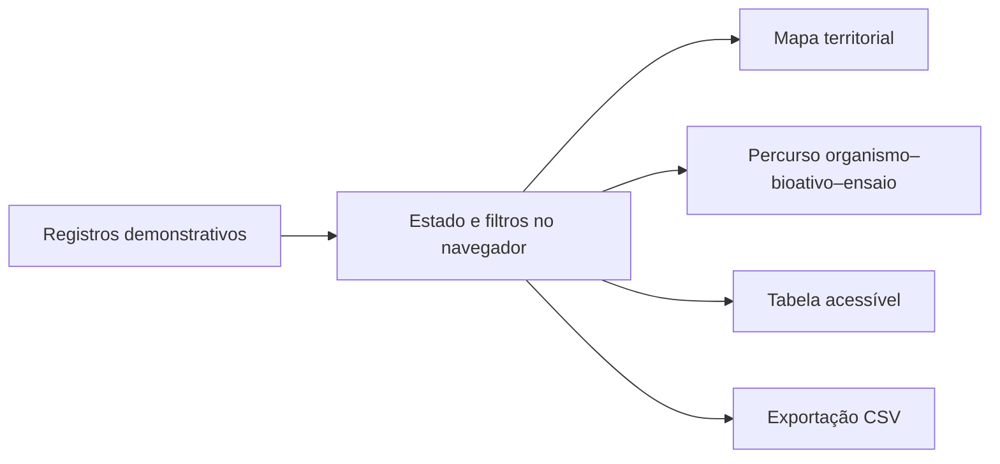
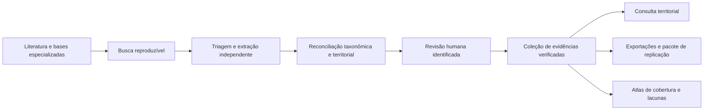

# Arquitetura da demonstração e evolução prevista

## Prova de conceito publicada

A versão pública é uma aplicação estática autocontida. Essa decisão favorece avaliação imediata, portabilidade e preservação.

Não há servidor de aplicação, autenticação, rastreamento ou transmissão de consultas. Dados, estilos, scripts e imagens demonstrativas estão incorporados em `index.html`.

## Arquitetura científica prevista

A infraestrutura completa separará responsabilidades que a prova de conceito reúne em um único arquivo:

Cada resultado deverá manter a relação entre procedência, organismo, material, preparação ou biomolécula, ensaio, desfecho, passagem de sustentação e fonte. Identificadores reconhecidos apoiarão a ligação com recursos taxonômicos, químicos, proteicos e bibliográficos.

## Controles de qualidade

- protocolo de elegibilidade versionado;
- dupla extração em corpus de referência;
- concordância e erro relatados por campo;
- atribuição amazônica condicionada à procedência explícita do material;
- histórico de transformações e decisões curatoriais;
- distinção entre informação ausente, restrita e em revisão;
- testes funcionais, de acessibilidade, restauração e segurança;
- atualização documentada e depósitos persistentes.

## Acessibilidade e desempenho

Mapa e tabela oferecem percursos equivalentes. A interface implementa foco visível, navegação por teclado, regiões semânticas, mensagens para tecnologias assistivas, contraste em temas claro e escuro e redução de movimento conforme a preferência do sistema. O uso de aplicação estática também reduz o volume de transferência e o tempo de carregamento após o primeiro acesso.
